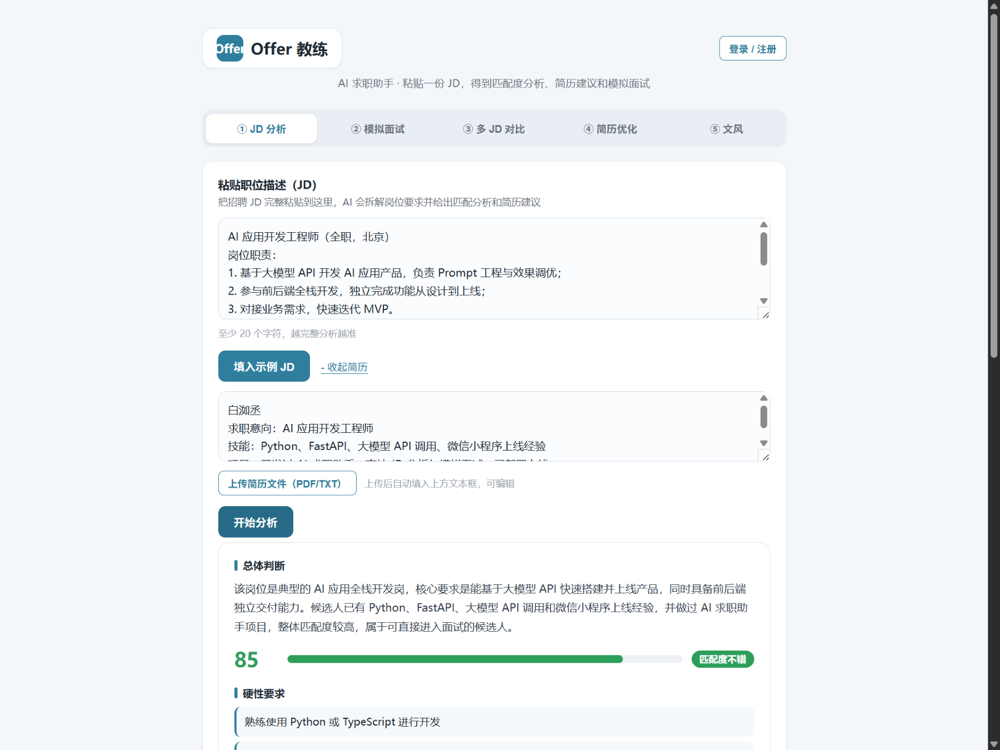
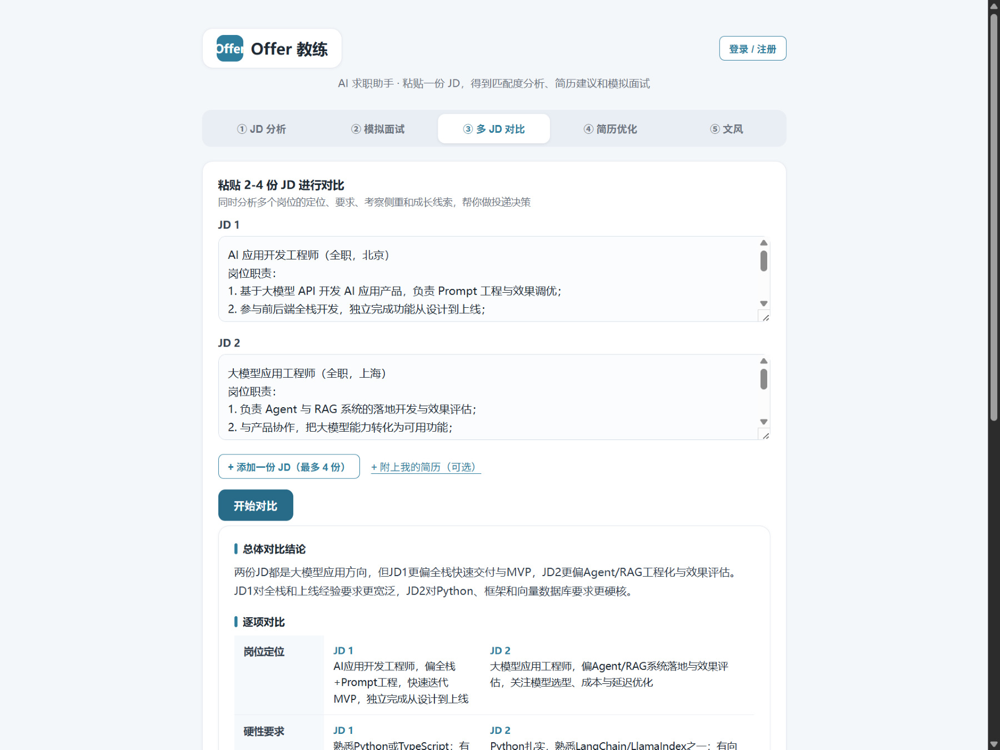
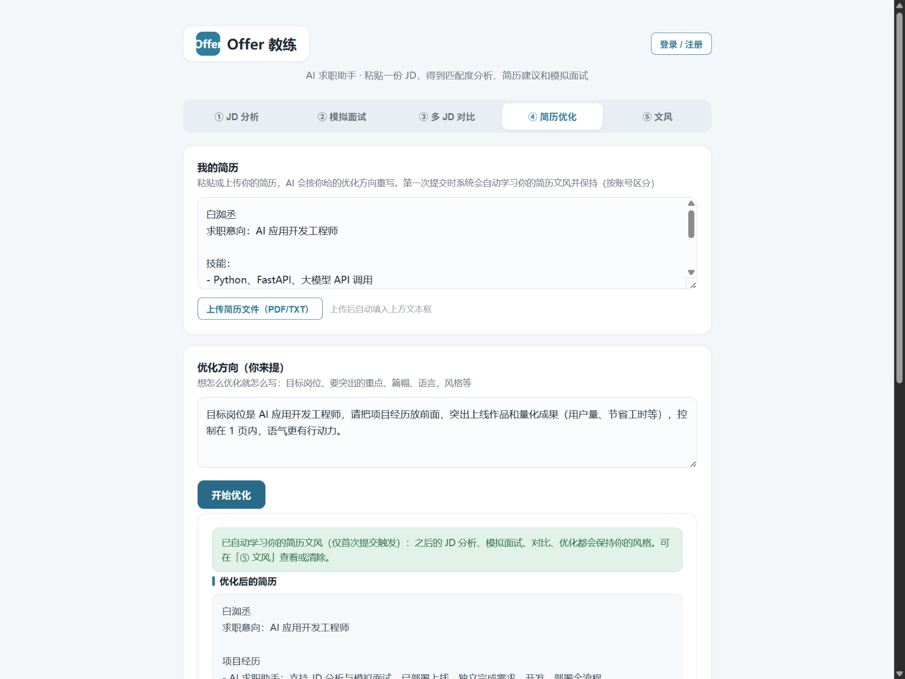
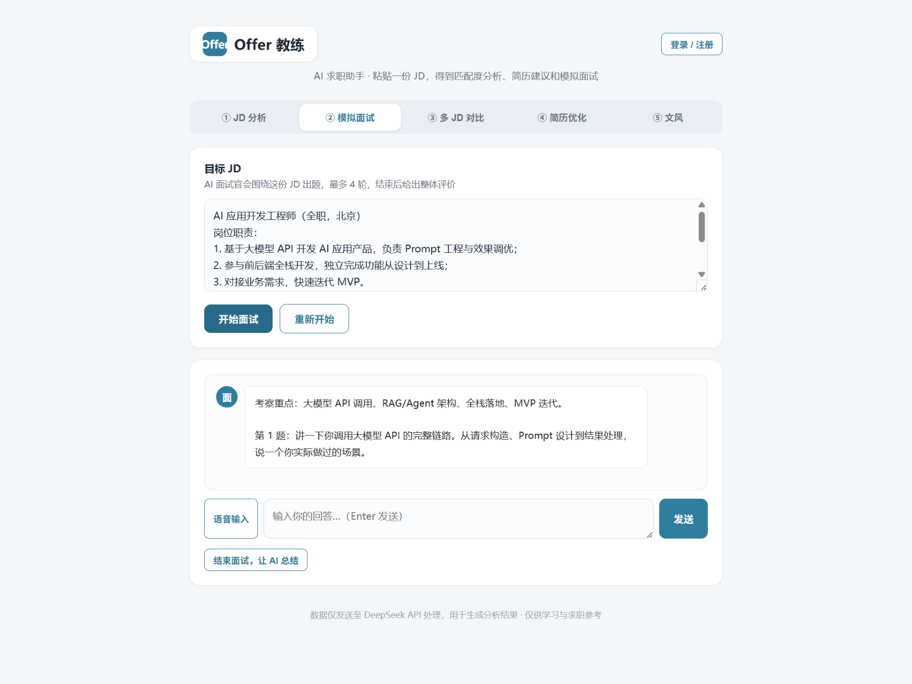
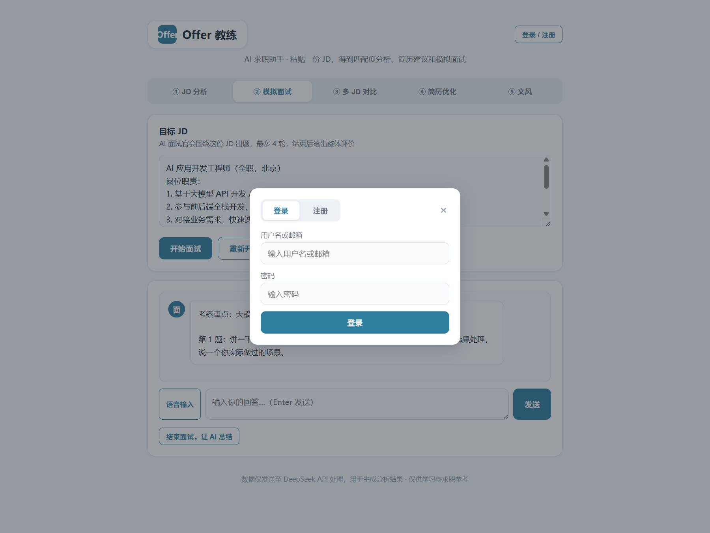
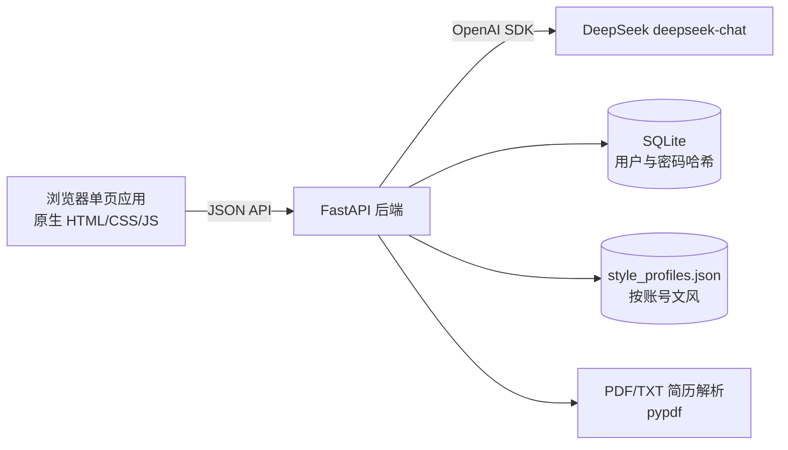

# Offer 教练 · AI 求职助手

一个把「读 JD、改简历、练面试」串起来的 AI 求职工具箱：粘贴一份招聘 JD，立刻得到 **匹配度分析 + 简历修改建议 + 面试考察点**，还能基于这份 JD 进行 **AI 模拟面试**（出题 → 点评 → 再出题，最多 4 轮），或者同时对比 2-4 份 JD 做投递决策。

> 为什么做它：求职过程中发现"读 JD、改简历、练面试"是三个重复且耗时的事，于是做了一个工具把它们串起来。我自己就是它的第一个用户。

## ✨ 亮点功能

| 功能 | 说明 |
| --- | --- |
| **JD 分析** | 粘贴 JD（可选附简历），输出总体判断、匹配度评分、硬性要求、加分项、简历修改建议、面试考察点；结果可一键复制为 Markdown |
| **模拟面试** | 基于 JD 出题，你作答后 AI 点评并出下一题，4 轮后给出整体评价；支持语音输入（浏览器支持时） |
| **多 JD 对比** | 同时对比 2-4 份 JD 的岗位定位、硬性要求、加分项、考察侧重、成长线索，给出投递建议 |
| **简历优化** | 粘贴/上传简历，按你给的优化方向（目标岗位、突出重点、篇幅风格等）重写简历，附改动说明与投递提醒 |
| **个人文风（自动学习）** | 每个账号第一次提交简历优化时，自动学习该简历的文风并保存；此后该账号所有输出（分析/面试/对比/优化）都保持此风格——**不同账号的观感完全不同** |
| **账号系统** | 用户名 + 密码 + 邮箱注册/登录（SQLite 存储，密码加盐哈希）；登录错误给出具体原因；登录后文风与账号绑定，匿名期学到的文风注册时自动迁移 |
| **简历文件上传** | 上传 PDF / TXT 简历，自动解析成文本填入，可用于分析和对比 |

## 📸 功能截图

**JD 分析**（匹配度评分 + 总体判断 + 硬性要求）



**多 JD 对比**（总体结论 + 逐项对比表）



**简历优化**（自动学习个人文风 + 按方向重写）



**模拟面试**（AI 面试官出题 + 语音输入）



**账号系统**（用户名 / 密码 / 邮箱，错误提示具体原因）



## 🏗 架构



- **后端**：Python + FastAPI + OpenAI SDK（兼容 DeepSeek API）
- **模型**：DeepSeek `deepseek-chat`
- **前端**：原生 HTML / CSS / JS，单文件无构建、零前端依赖
- **存储**：SQLite（账号）+ JSON（文风），运行期文件不入库

## 🚀 快速开始

```powershell
# 1. 进入项目目录
cd ai-job-assistant

# 2. 创建虚拟环境并安装依赖
python -m venv .venv
.\.venv\Scripts\python -m pip install -r requirements.txt

# 3. 配置密钥：复制 .env.example 为 .env，填入你的 DeepSeek API Key
#    （DeepSeek Key 在 https://platform.deepseek.com 申请）

# 4. 启动
.\.venv\Scripts\python -m uvicorn main:app --host 127.0.0.1 --port 8000
```

打开 http://127.0.0.1:8000 即可使用。

macOS / Linux 把 `.\.venv\Scripts\python` 换成 `.venv/bin/python` 即可。

## 📁 目录结构

```
ai-job-assistant/
├── main.py              # FastAPI 后端：业务接口 + 登录系统 + 文风管理
├── static/
│   └── index.html       # 前端单页（五个功能标签页 + 登录弹窗）
├── docs/screenshots/    # 功能截图（README 引用）
├── test_smoke.py        # 9 组回归测试：业务接口 + 按账号文风 + 登录系统
├── test_upload.py       # 简历文件上传测试（生成中文 PDF 验证）
├── requirements.txt     # Python 依赖
├── .env.example         # 密钥配置示例（复制为 .env 使用）
└── .gitignore           # 已排除 .env / users.db / 文风文件
```

## 🔌 接口说明

- `POST /api/analyze` — `{ "jd": "...", "resume": "(可选)", "uid": "账号标识" }` → 单份 JD 的结构化分析
- `POST /api/interview` — `{ "jd": "...", "messages": [...], "uid": "账号标识" }` → 面试官回复
- `POST /api/compare` — `{ "jds": [...], "resume": "(可选)", "uid": "账号标识" }` → 多 JD 对比（2-4 份）
- `POST /api/optimize_resume` — `{ "resume": "...", "direction": "...", "uid": "账号标识" }` → `{ optimized, changes, tips, style_learned, style_text }`（该账号首次提交时自动学习文风）
- `POST /api/upload_resume` — multipart 上传 `file`（PDF / TXT，≤10MB）→ `{ filename, chars, text }`
- `GET /api/style?uid=...` — 查看某账号文风（`{ enabled, style_text }`）
- `POST /api/style/save` — `{ "uid": "...", "style_text": "..." }` → 手动保存/修改文风
- `POST /api/style/clear` — `{ "uid": "..." }` → 清除该账号文风
- `POST /api/auth/register` — `{ "username": "...", "password": "...", "email": "...", "anon_uid": "(可选)" }` → 注册并登录（错误会返回具体原因）
- `POST /api/auth/login` — `{ "account": "用户名或邮箱", "password": "..." }` → 登录（未注册/密码错误会分别提示）
- `POST /api/auth/logout` — `{ "token": "..." }` → 退出登录
- `POST /api/auth/me` — `{ "token": "..." }` → 校验登录态，返回 `{ uid, username }`
- `GET /api/health` — 健康检查

## ✅ 测试

```powershell
# 全量回归（需服务已启动）：业务接口 + 按账号文风差异化 + 登录系统 9 组用例
.\.venv\Scripts\python test_smoke.py

# 简历文件上传测试（生成中文 PDF 验证解析）
.\.venv\Scripts\python test_upload.py
```

## 🔒 安全与说明

- 密码使用 PBKDF2（120,000 轮）加盐哈希存储，数据库不存明文。
- `.env`、`users.db`、文风文件均已加入 `.gitignore`，**不要把 API Key 提交到 GitHub**。
- 本项目为求职作品集项目，数据仅发送至 DeepSeek API 用于生成分析结果，仅供学习与求职参考。
